# Sela Tutor English

**AI English Speaking Tutor** — a real-time voice conversation partner for practicing spoken English, with a 3D talking avatar, on-device text-to-speech, and a 7-dimension evaluation report.

**Tutor Berbicara Bahasa Inggris berbasis AI** — teman latihan percakapan suara real-time dengan avatar 3D yang bergerak saat berbicara, text-to-speech yang berjalan di perangkat sendiri, dan laporan evaluasi 7 dimensi.

> Documentation is written in **two languages**: scroll down for 🇬🇧 **English**, or jump to 🇮🇩 **Bahasa Indonesia**.
> Dokumentasi ditulis dalam **dua bahasa**: gulir ke bawah untuk 🇬🇧 **English**, atau lompat ke 🇮🇩 **Bahasa Indonesia**.

| | |
| --- | --- |
| **Repository** | <https://github.com/hairift/English-Learning-Hub> |
| **Frontend** | React 19 · TypeScript · Vite 7 · Three.js |
| **Backend** | Node.js · Express 5 · Zod |
| **TTS sidecar** | Python · FastAPI · Supertonic 3 (on-device) |
| **Real-time voice** | Pipecat (Python) · SmallWebRTC *(optional)* |
| **Default LLM** | Groq — `qwen/qwen3.8-27b` |
| **Default TTS voice** | Supertonic `F1` — female, Indonesian, auto-switches to English |

---

# 🇬🇧 English

## 1. What this is

Sela Tutor English is a web app for practising **spoken English**. You pick a real-life scenario (job interview, business meeting, restaurant ordering, or your own custom scene), then have a continuous voice conversation with Sela — an AI tutor who listens without interrupting, asks natural follow-up questions, and writes you a full evaluation report afterwards.

There is no fixed quiz bank and no round counter. You just talk.

### Screenshots

**Home — brand bar, 3D coach, daily streak and growth tracking**

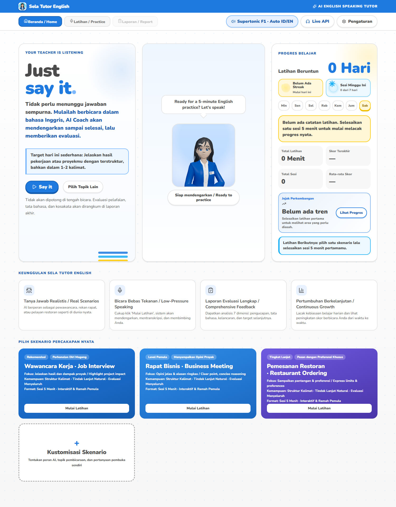

**Real-world scenario cards**

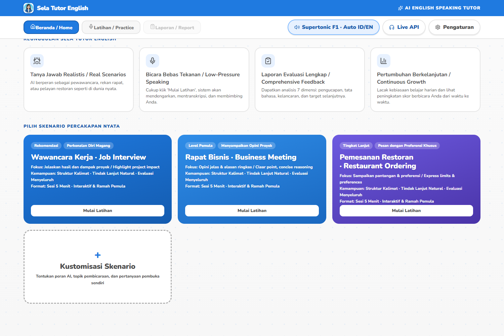

**Task selection and custom scenario builder**

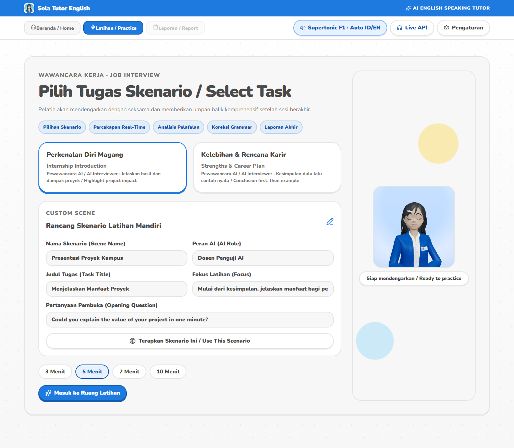

**Practice room — live transcript, mic input and voice controls**

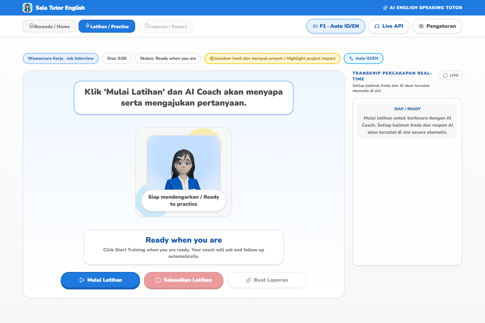

**Settings — provider configuration (Supertonic TTS / LLM / ASR)**

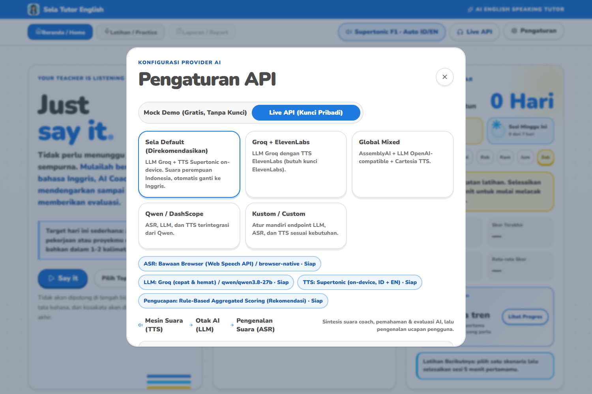

**Supertonic TTS controls — voice, language mode, speed, quality, preview**

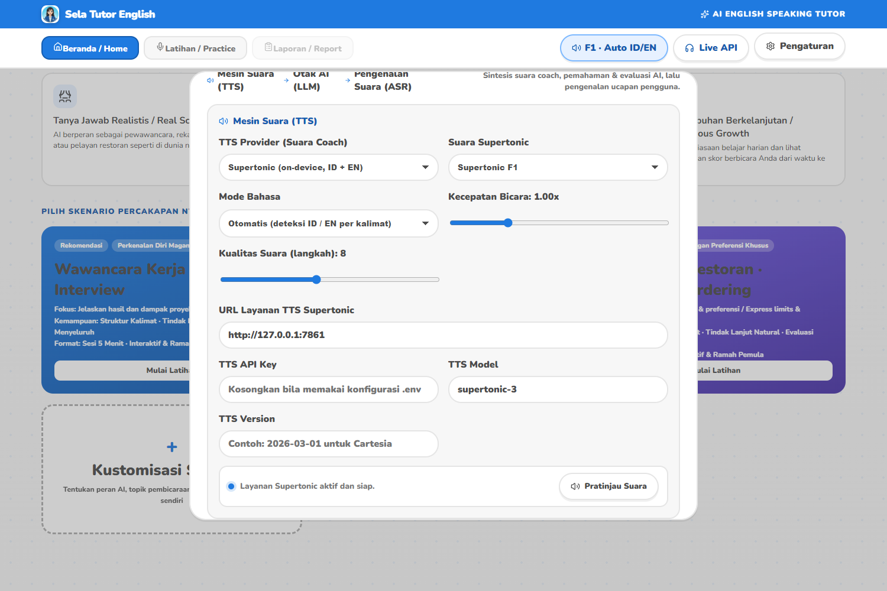

**Answering by voice or text**

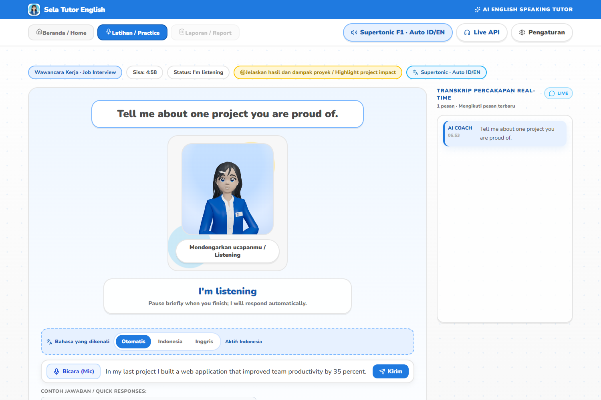

**Live conversation transcript**

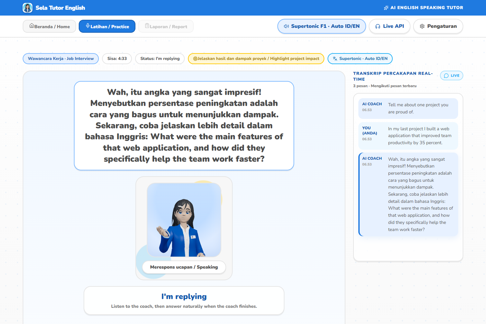

**Evaluation report — score, 7 dimensions, sentence fixes, action plan**

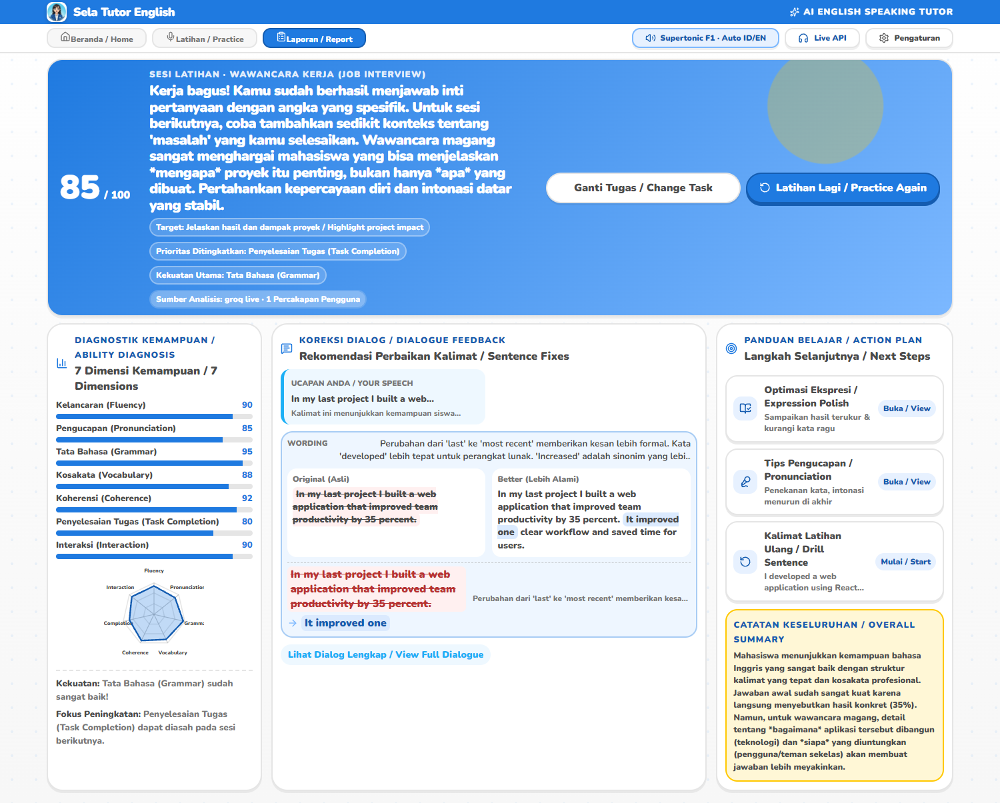

**Tablet (1024 px) and phone (390 px) — purpose-built layouts, no horizontal overflow**

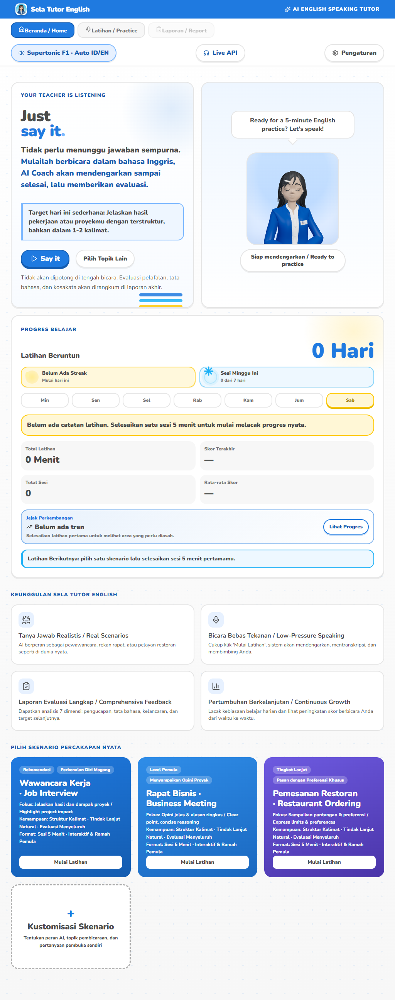

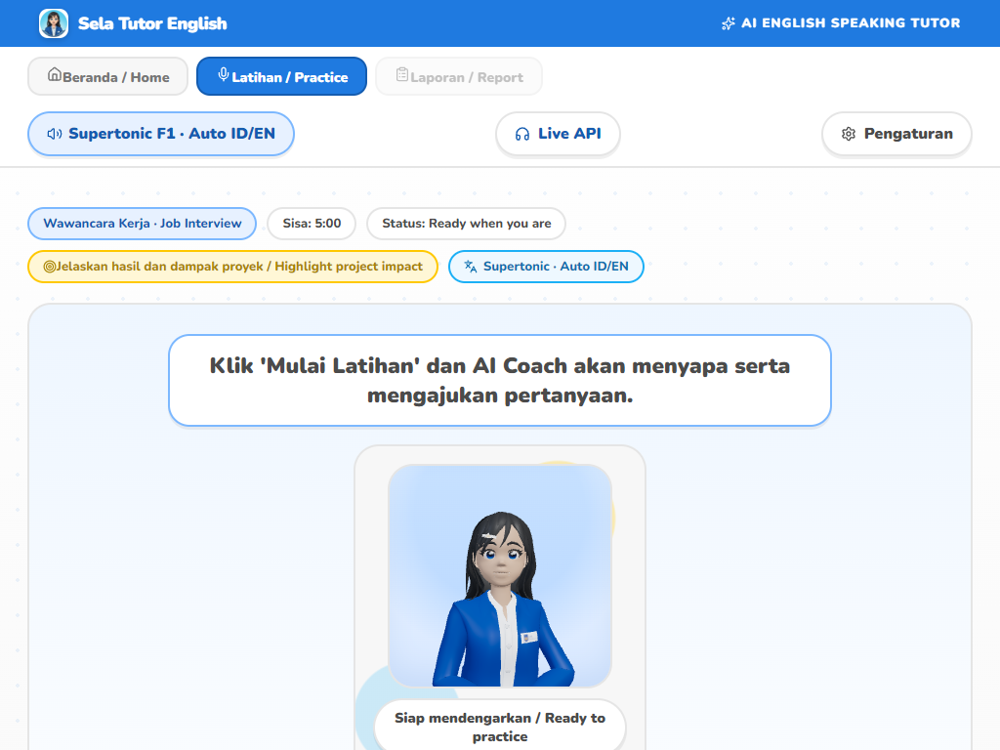

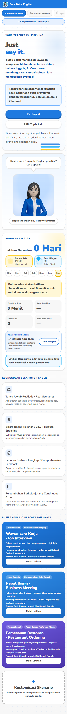

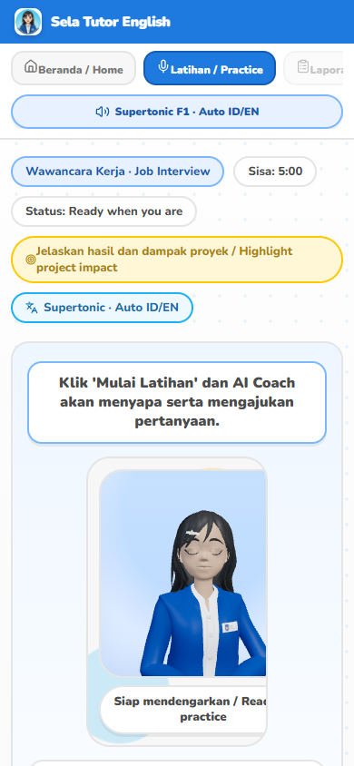

## 2. Feature list

| Area | What it does |
| --- | --- |
| **Scenario practice** | Built-in interview / meeting / restaurant scenarios plus a fully custom scenario builder (scene name, AI role, task title, focus, opening question). |
| **Real-time voice** | Continuous spoken conversation via the Pipecat WebRTC agent when available; otherwise falls back to backend TTS + browser speech synthesis. |
| **On-device TTS** | Supertonic 3 runs locally through a Python sidecar. Default voice is female Indonesian (`F1`), and the language switches automatically per sentence between Indonesian and English. |
| **Reliable voice engine** | Mock/fallback audio is rejected before playback, TTS requests retry once, and the browser fallback picks the best installed voice by language with a watchdog so a conversation can never hang. |
| **Number normalisation** | Raw numbers are converted to words before synthesis so TTS never mis-reads them. Handles currency, percentages, clock times, decimals, thousands separators, and per-digit spelling for phone numbers / NIK / OTP codes. |
| **3D avatar** | A rigged GLB character rendered with Three.js / React Three Fiber, with idle, talking, thinking and greeting animation clips. |
| **Lip sync** | Mouth shapes come from real audio analysis (RMS + three frequency bands mapped to five visemes). A procedural text-driven driver runs alongside it, so the mouth moves even when the voice comes from the browser's speech synthesis and cannot be analysed at all. |
| **Bilingual speech recognition** | Speech-to-text understands **both Indonesian and English**. Pick `Otomatis` / `Indonesia` / `Inggris` right above the answer bar; auto mode adapts between recognition sessions. |
| **Live transcript** | Every user and AI turn is captured, auto-scrolled, with an "N new messages" jump button when you scroll up. |
| **Evaluation report** | LLM-generated 7-dimension score (fluency, pronunciation, grammar, vocabulary, coherence, task completion, interaction), sentence-level before/after fixes, expression upgrades, pronunciation tips and a next-practice plan. |
| **Progress tracking** | Daily check-in, streak, growth trail, per-session history stored in `localStorage` — all derived from real practice data, never placeholder numbers. |
| **Provider settings** | Configure LLM, ASR, TTS and pronunciation providers from the UI — including bring-your-own API keys, presets, and a live voice preview. |
| **Responsive layout** | Purpose-built breakpoints for desktop, laptop, tablet landscape, tablet portrait, phone and small phone. Navigation stays on one scrollable row and nothing overflows horizontally. |
| **Mock mode** | The whole app works with zero API keys for demos and offline testing. |

## 3. Architecture

```
┌───────────────────────────────────────────────────────────────┐
│  Browser — React 19 + TypeScript + Vite                       │
│  • App shell, screens, transcript, report UI                  │
│  • Sela3DScene (Three.js, lazy-loaded) + lip-sync store        │
│  • Web Speech API fallback for mic + speech synthesis          │
└───────────────┬───────────────────────────────┬───────────────┘
                │ /api/*  (Vite dev/preview proxy)│ WebRTC
                ▼                                ▼
┌───────────────────────────────┐   ┌───────────────────────────┐
│  Node API — Express 5 :5174   │   │  Pipecat voice agent      │
│  • sessions, turns, reports   │──▶│  Python :7860 (optional)  │
│  • provider dispatch          │   │  VAD · STT · LLM · TTS    │
│  • settings persistence       │   └───────────────────────────┘
└───────────────┬───────────────┘
                │ HTTP
                ▼
┌───────────────────────────────┐        ┌──────────────────────┐
│  Supertonic TTS sidecar       │        │  External LLM / STT  │
│  Python · FastAPI :7861       │        │  Groq · OpenAI · …   │
│  normaliser + ONNX engine     │        └──────────────────────┘
└───────────────────────────────┘
```

**Key design decisions**

- **The text normaliser lives in `shared/`** so both the Node server and the browser use the exact same number-to-word logic.
- **Supertonic is a sidecar, not an in-process dependency.** If it is offline the app keeps working: the backend reports `local-offline` and falls back to another TTS provider or the browser.
- **The 3D scene is lazy-loaded** (`Sela3DScene.tsx`) and wrapped in an error boundary, so Three.js never blocks first paint and a WebGL failure degrades to a static photo.
- **Lip sync is a global external store** (`src/lipsync/`) consumed via `useSyncExternalStore`, so any audio source — TTS element or WebRTC bot stream — can drive the same visemes.

## 4. Quick start

### Prerequisites

- **Node.js 20+** (developed on 22.x)
- **Python 3.10+** (for the Supertonic TTS sidecar)
- A modern Chromium/Firefox browser

### 1. Install and run the web app

```bash
npm install
cp .env.example .env      # then fill in your keys
npm run dev               # backend :5174 + frontend :5173
```

Open <http://127.0.0.1:5173>.

### 2. Start the Supertonic TTS sidecar

The first run creates a virtual environment, installs dependencies and downloads the model (~400 MB) into your Hugging Face cache.

```bash
npm run dev:tts           # service on http://127.0.0.1:7861
```

Or start everything at once:

```bash
npm run dev:all           # TTS + backend + frontend
```

### 3. Verify

```bash
curl http://127.0.0.1:7861/health    # TTS service
curl http://127.0.0.1:5174/api/health # Node API + provider status
```

In the app, the navbar chip shows the active voice and language mode (e.g. `F1 · Auto ID/EN`). If Supertonic is not running the chip shows a warning dot and the app uses a fallback voice.

### Scripts

| Command | Purpose |
| --- | --- |
| `npm run dev` | Backend + frontend (no TTS sidecar) |
| `npm run dev:all` | TTS sidecar + backend + frontend |
| `npm run dev:tts` | Supertonic TTS sidecar only |
| `npm run dev:server` | Node API only |
| `npm run dev:client` | Vite dev server only |
| `npm run build` | Type-check + production build to `dist/` |
| `npm start` | Serve `dist/` **and** the API on one port (production / hosting) |
| `npm run typecheck` | TypeScript check only |
| `npm test` | Run the Vitest suite |

### 4. Single-port production mode (hosting)

`server/production.ts` serves the built frontend and the API from **one** process, so
the app can be published to any host that exposes a single HTTP port:

```bash
npm run build
npm start        # listens on $PORT (default 5174) and binds 0.0.0.0
```

The Supertonic sidecar is optional in this mode — if it is not running, the frontend
falls back to the browser's built-in speech synthesis, so practice still works.

> **Why the free hosted preview uses the browser voice.** A free single-port
> sandbox cannot carry the Supertonic engine: the ONNX models alone are **385 MB**
> (a 245 MB `vector_estimator.onnx`, a 97 MB `vocoder.onnx` and a 35 MB
> `text_encoder.onnx`) on top of a ~174 MB Python virtualenv, and the sandbox
> exposes one HTTP port with no Python runtime. Downloading and loading that on
> every cold start would blow past the startup limit. So on the hosted link
> `/api/health` reports `tts.status = "local-offline"`, the voice chip honestly
> reads **`Suara browser (cadangan) · Auto ID/EN`**, and the browser's own voice
> speaks instead. **Lip sync still works** — the procedural mouth driver runs for
> every utterance and does not depend on being able to analyse the audio.
> To hear the real Supertonic voice, run the app locally (`npm run dev:tts`).

## 5. Configuration

All configuration lives in `.env` (git-ignored; `.env.example` documents every option). Settings can also be changed at runtime from the in-app **Settings** panel, which persists to `.sela-settings.json`.

### Default preset — `sela-default`

| Variable | Default | Notes |
| --- | --- | --- |
| `API_MODE` | `live` | `mock` runs everything offline without keys |
| `API_PROVIDER_PRESET` | `sela-default` | Groq LLM + Supertonic TTS |
| `LLM_PROVIDER` | `groq` | |
| `LLM_BASE_URL` | `https://api.groq.com/openai/v1` | |
| `LLM_MODEL` | `qwen/qwen3.8-27b` | |
| `LLM_API_KEY` | — | **required** for live mode |
| `TTS_PROVIDER` | `supertonic` | |
| `TTS_VOICE_ID` | `F1` | `F1`–`F5` female, `M1`–`M5` male |
| `TTS_LANGUAGE_MODE` | `auto` | `auto` \| `id` \| `en` |
| `TTS_SPEED` | `1` | `0.7`–`2.0` |
| `TTS_STEPS` | `8` | `5`–`12` (higher = better quality, slower) |
| `TTS_SERVICE_URL` | `http://127.0.0.1:7861` | |
| `ASR_PROVIDER` | `mock` | `mock` = browser Web Speech API |

Other presets are available: `groq-elevenlabs`, `global-mixed` (AssemblyAI + OpenAI-compatible + Cartesia), `china-qwen`, and `custom`.

## 6. Supertonic TTS and the number problem

Supertonic's built-in text normaliser is tuned for English. With `lang="id"` it tends to read `15.000` as a decimal or spell phone numbers as one huge number. The fix is to **never send raw digits to the engine**.

Normalisation happens in two defensive layers:

1. **`shared/textNormalizer.ts`** (primary, used by both Node and the browser)
2. **`tts_service/normalizer.py`** (safety net for direct API callers)

| Input | Output |
| --- | --- |
| `Rp15.000` | `lima belas ribu rupiah` |
| `IDR 2.500.000` | `dua juta lima ratus ribu rupiah` |
| `50%` | `lima puluh persen` |
| `14:30` | `jam empat belas lewat tiga puluh` |
| `3,5` | `tiga koma lima` |
| `081234567890` | `nol delapan satu dua tiga empat lima enam tujuh delapan sembilan nol` |
| `$1,250` | `one thousand, two hundred and fifty dollars` |
| `raised $5.2M` | `raised five point two million dollars` |

Placeholders used while normalising are encoded as Private Use Area characters rather than digits — otherwise the final "convert remaining digits" pass would rewrite the placeholder index itself and corrupt the output.

See [`docs/tts-supertonic.md`](docs/tts-supertonic.md) for the full specification.

## 7. 3D avatar and lip sync

The avatar is `public/models/sela-tutor.glb` (≈12 MB). It exposes eight morph targets:

| Morph target | Purpose |
| --- | --- |
| `a`, `i`, `u`, `e`, `o` | Visemes for lip sync |
| `blink.l`, `blink.r`, `blink.all` | Blinking |

Animation clips: `Idle`, `Talking`, `Thinking`, `Greeting`, `Nodding`, `Shaking Head`, `Confused`, `Goodbye`. A weight-only `Talking_%temp` clip is filtered out.

Lip sync works in three tiers:

1. **Audio analysis** — `AudioContext` + `AnalyserNode` measures RMS and three frequency bands, mapping energy to the five visemes with smoothing.
2. **WebRTC stream** — the bot's audio track is registered with the same analyser, so the mouth moves during a Pipecat call.
3. **Text fallback** — if audio cannot be analysed (e.g. browser `speechSynthesis`), a timer drives visemes from the text being spoken.

> **Maintainer note:** the `AudioContext` must be unlocked by a user gesture before
> playback. `pasangPembukaAudio()` resumes it on the first interaction; if the context
> cannot run, the `<audio>` element is deliberately **not** routed through Web Audio
> (otherwise the speech would be silent) and the text fallback takes over.

See [`docs/3d-avatar-lipsync.md`](docs/3d-avatar-lipsync.md).

## 8. Testing

```bash
npm test          # 19 test files / 86 tests
npm run typecheck # tsc --noEmit
npm run build     # production build
```

The suite covers the API surface, session lifecycle, report generation, provider settings, the text normaliser, the growth/progress derivation, and the avatar fallback behaviour.

## 9. Documentation index

| Document | Contents |
| --- | --- |
| [`docs/README.md`](docs/README.md) | Documentation index |
| [`docs/architecture.md`](docs/architecture.md) | System design, data flow, module map |
| [`docs/user-guide.md`](docs/user-guide.md) | Step-by-step usage guide |
| [`docs/provider-setup.md`](docs/provider-setup.md) | Configuring LLM / ASR / TTS providers |
| [`docs/tts-supertonic.md`](docs/tts-supertonic.md) | TTS sidecar and number normalisation |
| [`docs/3d-avatar-lipsync.md`](docs/3d-avatar-lipsync.md) | Avatar pipeline and lip sync |
| [`docs/responsive-and-voice.md`](docs/responsive-and-voice.md) | Responsive breakpoints, always-on mouth motion, bilingual speech recognition, TTS reliability |
| [`docs/visual-design-system.md`](docs/visual-design-system.md) | Blue design system and tokens |
| [`docs/product-requirements.md`](docs/product-requirements.md) | Requirements and feature coverage |
| [`docs/ui-information-architecture.md`](docs/ui-information-architecture.md) | Navigation structure and screen responsibilities |
| [`docs/coach-checkin-interactions.md`](docs/coach-checkin-interactions.md) | Coach persona, states, and check-in rules |
| [`docs/development.md`](docs/development.md) | Development workflow and conventions |
| [`docs/development-plan.md`](docs/development-plan.md) | Delivery plan and verification gates |
| [`docs/development-log.md`](docs/development-log.md) | Chronological development record |

Every document is bilingual — an English section followed by a Bahasa Indonesia section.

## 10. Conventions

- **Code comments and new variables are written in Indonesian** (`muatPengaturan`, `izinkanSimpan`, `simpanEjaan`, …) so the project stays easy to maintain for its author. Identifiers that mirror external APIs keep their original names.
- **No emoji in the UI.** Every icon is a `lucide-react` component.
- **Brand colour is blue**, defined by CSS custom properties in `src/styles.css`.

---

# 🇮🇩 Bahasa Indonesia

## 1. Apa ini

Sela Tutor English adalah aplikasi web untuk melatih **kemampuan berbicara bahasa Inggris**. Anda memilih skenario dunia nyata (wawancara kerja, rapat bisnis, memesan di restoran, atau skenario buatan sendiri), lalu mengobrol dengan suara secara mengalir bersama Sela — tutor AI yang mendengarkan tanpa memotong, mengajukan pertanyaan lanjutan yang natural, dan menyusun laporan evaluasi lengkap setelah sesi berakhir.

Tidak ada bank soal dan tidak ada hitungan ronde. Anda cukup berbicara.

### Tangkapan layar

**Beranda — bilah merek, coach 3D, streak harian, dan pelacakan pertumbuhan**


**Kartu skenario percakapan nyata**


**Pemilihan tugas dan pembuat skenario kustom**


**Ruang latihan — transkrip langsung, input mic, dan kontrol suara**


**Pengaturan — konfigurasi provider (Supertonic TTS / LLM / ASR)**


**Kontrol Supertonic TTS — suara, mode bahasa, kecepatan, kualitas, pratinjau**


**Menjawab lewat suara atau teks**


**Transkrip percakapan langsung**


**Laporan evaluasi — skor, 7 dimensi, koreksi kalimat, rencana tindak lanjut**


**Tablet (1024 px) dan ponsel (390 px) — tata letak khusus, tanpa luapan mendatar**


## 2. Daftar fitur

| Bagian | Fungsi |
| --- | --- |
| **Latihan skenario** | Skenario bawaan wawancara / rapat / restoran, plus pembuat skenario kustom (nama scene, peran AI, judul tugas, fokus, pertanyaan pembuka). |
| **Suara real-time** | Percakapan suara mengalir lewat agen WebRTC Pipecat bila tersedia; jika tidak, otomatis memakai TTS backend + speech synthesis browser. |
| **TTS on-device** | Supertonic 3 berjalan lokal lewat sidecar Python. Suara default perempuan Indonesia (`F1`), dan bahasanya berganti otomatis per kalimat antara Indonesia dan Inggris. |
| **Mesin suara yang andal** | Audio mock/cadangan ditolak sebelum diputar, permintaan TTS dicoba ulang sekali, dan cadangan browser memilih suara terbaik sesuai bahasa dengan pengaman waktu agar percakapan tidak pernah menggantung. |
| **Normalisasi angka** | Angka mentah diubah menjadi kata sebelum sintesis agar TTS tidak salah baca. Menangani mata uang, persen, jam, desimal, pemisah ribuan, dan ejaan per digit untuk nomor HP / NIK / kode OTP. |
| **Avatar 3D** | Karakter GLB ber-rig yang dirender dengan Three.js / React Three Fiber, dengan klip animasi idle, bicara, berpikir, dan sapaan. |
| **Lip sync** | Bentuk mulut berasal dari analisis audio nyata (RMS + tiga pita frekuensi yang dipetakan ke lima viseme). Penggerak prosedural dari teks berjalan berdampingan, sehingga mulut tetap bergerak walau suara berasal dari sintesis browser yang tidak bisa dianalisis sama sekali. |
| **Pengenalan suara bilingual** | Speech-to-text mengerti **Bahasa Indonesia dan Inggris**. Pilih `Otomatis` / `Indonesia` / `Inggris` tepat di atas bilah jawaban; mode otomatis menyesuaikan diri antar sesi rekaman. |
| **Transkrip langsung** | Setiap giliran pengguna dan AI dicatat, otomatis digulir, plus tombol lompat "N pesan baru" saat Anda menggulir ke atas. |
| **Laporan evaluasi** | Skor 7 dimensi dari LLM (kelancaran, pengucapan, tata bahasa, kosakata, koherensi, penyelesaian tugas, interaksi), koreksi kalimat sebelum/sesudah, peningkatan ekspresi, tips pengucapan, dan rencana latihan berikutnya. |
| **Pelacakan progres** | Check-in harian, streak, jejak pertumbuhan, dan riwayat tiap sesi yang disimpan di `localStorage` — semuanya diturunkan dari data latihan nyata, bukan angka contoh. |
| **Pengaturan provider** | Atur provider LLM, ASR, TTS, dan penilaian pengucapan dari UI — termasuk memakai kunci API sendiri, preset siap pakai, dan pratinjau suara langsung. |
| **Tata letak responsif** | Titik henti khusus untuk desktop, laptop, tablet lanskap, tablet potret, ponsel, dan ponsel kecil. Navigasi tetap satu baris yang bisa digeser dan tidak ada luapan mendatar. |
| **Mode mock** | Seluruh aplikasi bisa berjalan tanpa kunci API sama sekali untuk demo dan pengujian offline. |

## 3. Arsitektur

```
┌───────────────────────────────────────────────────────────────┐
│  Browser — React 19 + TypeScript + Vite                       │
│  • Kerangka aplikasi, layar, transkrip, UI laporan            │
│  • Sela3DScene (Three.js, lazy-load) + penyimpanan lip sync   │
│  • Cadangan Web Speech API untuk mic + sintesis suara         │
└───────────────┬───────────────────────────────┬───────────────┘
                │ /api/*  (proxy Vite)           │ WebRTC
                ▼                                ▼
┌───────────────────────────────┐   ┌───────────────────────────┐
│  API Node — Express 5 :5174   │   │  Agen suara Pipecat       │
│  • sesi, giliran, laporan     │──▶│  Python :7860 (opsional)  │
│  • penerusan ke provider      │   │  VAD · STT · LLM · TTS    │
│  • penyimpanan pengaturan     │   └───────────────────────────┘
└───────────────┬───────────────┘
                │ HTTP
                ▼
┌───────────────────────────────┐        ┌──────────────────────┐
│  Sidecar TTS Supertonic       │        │  LLM / STT eksternal │
│  Python · FastAPI :7861       │        │  Groq · OpenAI · …   │
│  normaliser + mesin ONNX      │        └──────────────────────┘
└───────────────────────────────┘
```

**Keputusan desain penting**

- **Normaliser teks diletakkan di `shared/`** supaya server Node dan browser memakai logika angka-ke-kata yang persis sama.
- **Supertonic berjalan sebagai sidecar, bukan dependensi in-process.** Kalau layanan mati, aplikasi tetap jalan: backend melaporkan `local-offline` lalu memakai provider TTS lain atau browser.
- **Scene 3D dimuat lazy** (`Sela3DScene.tsx`) dan dibungkus error boundary, sehingga Three.js tidak menahan render pertama dan kegagalan WebGL turun ke foto statis.
- **Lip sync memakai external store global** (`src/lipsync/`) yang dikonsumsi lewat `useSyncExternalStore`, jadi sumber audio apa pun — elemen TTS maupun stream bot WebRTC — bisa menggerakkan viseme yang sama.

## 4. Mulai cepat

### Prasyarat

- **Node.js 20+** (dikembangkan di 22.x)
- **Python 3.10+** (untuk sidecar TTS Supertonic)
- Browser Chromium/Firefox modern

### 1. Pasang dan jalankan aplikasi web

```bash
npm install
cp .env.example .env      # lalu isi kunci API Anda
npm run dev               # backend :5174 + frontend :5173
```

Buka <http://127.0.0.1:5173>.

### 2. Jalankan sidecar TTS Supertonic

Pada eksekusi pertama, skrip akan membuat virtual environment, memasang dependensi, dan mengunduh model (~400 MB) ke cache Hugging Face.

```bash
npm run dev:tts           # layanan di http://127.0.0.1:7861
```

Atau jalankan semuanya sekaligus:

```bash
npm run dev:all           # TTS + backend + frontend
```

### 3. Verifikasi

```bash
curl http://127.0.0.1:7861/health     # layanan TTS
curl http://127.0.0.1:5174/api/health # API Node + status provider
```

Di aplikasi, chip pada navbar menampilkan suara dan mode bahasa yang aktif (mis. `F1 · Auto ID/EN`). Kalau Supertonic tidak berjalan, chip menampilkan titik peringatan dan aplikasi memakai suara cadangan.

### Skrip

| Perintah | Kegunaan |
| --- | --- |
| `npm run dev` | Backend + frontend (tanpa sidecar TTS) |
| `npm run dev:all` | Sidecar TTS + backend + frontend |
| `npm run dev:tts` | Hanya sidecar TTS Supertonic |
| `npm run dev:server` | Hanya API Node |
| `npm run dev:client` | Hanya Vite dev server |
| `npm run build` | Type-check + build produksi ke `dist/` |
| `npm start` | Melayani `dist/` **dan** API di satu port (produksi / hosting) |
| `npm run typecheck` | Hanya pemeriksaan TypeScript |
| `npm test` | Menjalankan rangkaian tes Vitest |

### 4. Mode produksi satu port (hosting)

`server/production.ts` melayani frontend hasil build dan API dari **satu** proses,
sehingga aplikasi bisa dipublikasikan ke host mana pun yang menyediakan satu port HTTP:

```bash
npm run build
npm start        # mendengarkan $PORT (default 5174) dan bind 0.0.0.0
```

Sidecar Supertonic bersifat opsional pada mode ini — bila tidak berjalan, frontend
memakai suara bawaan browser sehingga latihan tetap bisa dilakukan.

> **Kenapa pratinjau hosting gratis memakai suara browser.** Sandbox satu port
> gratis tidak bisa membawa mesin Supertonic: berkas model ONNX-nya saja **385 MB**
> (`vector_estimator.onnx` 245 MB, `vocoder.onnx` 97 MB, dan `text_encoder.onnx`
> 35 MB) di atas virtualenv Python ~174 MB, sedangkan sandbox hanya membuka satu
> port HTTP dan tidak menyediakan runtime Python. Mengunduh lalu memuatnya di
> setiap start dingin akan melewati batas waktu start. Karena itu pada tautan
> hosting `/api/health` melaporkan `tts.status = "local-offline"`, chip mesin suara
> dengan jujur berbunyi **`Suara browser (cadangan) · Auto ID/EN`**, dan suara
> browser yang berbicara. **Lip sync tetap bekerja** — penggerak mulut prosedural
> berjalan untuk setiap ucapan dan tidak bergantung pada kemampuan menganalisis
> audio. Untuk mendengar suara Supertonic yang asli, jalankan aplikasi secara lokal
> (`npm run dev:tts`).

## 5. Konfigurasi

Seluruh konfigurasi berada di `.env` (diabaikan git; `.env.example` mendokumentasikan semua opsi). Pengaturan juga bisa diubah saat aplikasi berjalan lewat panel **Pengaturan**, yang disimpan ke `.sela-settings.json`.

### Preset default — `sela-default`

| Variabel | Default | Catatan |
| --- | --- | --- |
| `API_MODE` | `live` | `mock` menjalankan semuanya offline tanpa kunci |
| `API_PROVIDER_PRESET` | `sela-default` | LLM Groq + TTS Supertonic |
| `LLM_PROVIDER` | `groq` | |
| `LLM_BASE_URL` | `https://api.groq.com/openai/v1` | |
| `LLM_MODEL` | `qwen/qwen3.8-27b` | |
| `LLM_API_KEY` | — | **wajib** untuk mode live |
| `TTS_PROVIDER` | `supertonic` | |
| `TTS_VOICE_ID` | `F1` | `F1`–`F5` perempuan, `M1`–`M5` laki-laki |
| `TTS_LANGUAGE_MODE` | `auto` | `auto` \| `id` \| `en` |
| `TTS_SPEED` | `1` | `0.7`–`2.0` |
| `TTS_STEPS` | `8` | `5`–`12` (makin tinggi makin bagus, makin lambat) |
| `TTS_SERVICE_URL` | `http://127.0.0.1:7861` | |
| `ASR_PROVIDER` | `mock` | `mock` = Web Speech API browser |

Preset lain juga tersedia: `groq-elevenlabs`, `global-mixed` (AssemblyAI + OpenAI-compatible + Cartesia), `china-qwen`, dan `custom`.

## 6. TTS Supertonic dan masalah angka

Normaliser teks bawaan Supertonic dioptimalkan untuk bahasa Inggris. Pada `lang="id"`, ia cenderung membaca `15.000` sebagai desimal atau mengeja nomor HP sebagai satu bilangan besar. Solusinya: **jangan pernah mengirim digit mentah ke mesin TTS**.

Normalisasi dilakukan dalam dua lapis pertahanan:

1. **`shared/textNormalizer.ts`** (utama, dipakai Node dan browser)
2. **`tts_service/normalizer.py`** (jaring pengaman untuk pemanggilan API langsung)

| Masukan | Keluaran |
| --- | --- |
| `Rp15.000` | `lima belas ribu rupiah` |
| `IDR 2.500.000` | `dua juta lima ratus ribu rupiah` |
| `50%` | `lima puluh persen` |
| `14:30` | `jam empat belas lewat tiga puluh` |
| `3,5` | `tiga koma lima` |
| `081234567890` | `nol delapan satu dua tiga empat lima enam tujuh delapan sembilan nol` |
| `$1,250` | `one thousand, two hundred and fifty dollars` |
| `raised $5.2M` | `raised five point two million dollars` |

Penanda sementara yang dipakai saat normalisasi dikodekan memakai karakter Private Use Area, bukan digit — kalau tidak, langkah terakhir "ubah sisa angka" akan menulis ulang indeks penanda itu sendiri dan merusak hasil.

Spesifikasi lengkap ada di [`docs/tts-supertonic.md`](docs/tts-supertonic.md).

## 7. Avatar 3D dan lip sync

Avatar berada di `public/models/sela-tutor.glb` (±12 MB) dan menyediakan delapan morph target:

| Morph target | Fungsi |
| --- | --- |
| `a`, `i`, `u`, `e`, `o` | Viseme untuk lip sync |
| `blink.l`, `blink.r`, `blink.all` | Kedipan mata |

Klip animasi: `Idle`, `Talking`, `Thinking`, `Greeting`, `Nodding`, `Shaking Head`, `Confused`, `Goodbye`. Klip `Talking_%temp` yang hanya berisi bobot disaring keluar.

Lip sync bekerja dalam tiga tingkat:

1. **Analisis audio** — `AudioContext` + `AnalyserNode` mengukur RMS dan tiga pita frekuensi, lalu memetakan energinya ke lima viseme dengan penghalusan.
2. **Stream WebRTC** — track audio bot didaftarkan ke analiser yang sama, sehingga mulut ikut bergerak selama panggilan Pipecat.
3. **Cadangan teks** — bila audio tidak bisa dianalisis (mis. `speechSynthesis` browser), timer menggerakkan viseme dari teks yang sedang diucapkan.

Lihat [`docs/3d-avatar-lipsync.md`](docs/3d-avatar-lipsync.md).

## 8. Pengujian

```bash
npm test          # 19 berkas tes / 86 tes
npm run typecheck # tsc --noEmit
npm run build     # build produksi
```

Rangkaian tes mencakup permukaan API, siklus hidup sesi, pembuatan laporan, pengaturan provider, normaliser teks, perhitungan progres belajar, dan perilaku cadangan avatar.

## 9. Indeks dokumentasi

| Dokumen | Isi |
| --- | --- |
| [`docs/README.md`](docs/README.md) | Indeks dokumentasi |
| [`docs/architecture.md`](docs/architecture.md) | Rancangan sistem, alur data, peta modul |
| [`docs/user-guide.md`](docs/user-guide.md) | Panduan penggunaan langkah demi langkah |
| [`docs/provider-setup.md`](docs/provider-setup.md) | Cara mengatur provider LLM / ASR / TTS |
| [`docs/tts-supertonic.md`](docs/tts-supertonic.md) | Sidecar TTS dan normalisasi angka |
| [`docs/3d-avatar-lipsync.md`](docs/3d-avatar-lipsync.md) | Pipeline avatar dan lip sync |
| [`docs/responsive-and-voice.md`](docs/responsive-and-voice.md) | Titik henti responsif, gerak mulut yang selalu hidup, pengenalan suara bilingual, keandalan TTS |
| [`docs/visual-design-system.md`](docs/visual-design-system.md) | Sistem desain biru dan token warna |
| [`docs/product-requirements.md`](docs/product-requirements.md) | Kebutuhan dan cakupan fitur |
| [`docs/ui-information-architecture.md`](docs/ui-information-architecture.md) | Struktur navigasi dan tanggung jawab layar |
| [`docs/coach-checkin-interactions.md`](docs/coach-checkin-interactions.md) | Persona pelatih, status, dan aturan check-in |
| [`docs/development.md`](docs/development.md) | Alur kerja pengembangan dan konvensi |
| [`docs/development-plan.md`](docs/development-plan.md) | Rencana pengiriman dan gerbang verifikasi |
| [`docs/development-log.md`](docs/development-log.md) | Catatan pengembangan kronologis |

Setiap dokumen bersifat bilingual — bagian English diikuti bagian Bahasa Indonesia.

## 10. Konvensi

- **Komentar kode dan variabel baru ditulis dalam Bahasa Indonesia** (`muatPengaturan`, `izinkanSimpan`, `simpanEjaan`, …) agar proyek tetap mudah dirawat oleh pemiliknya. Identifier yang mengikuti API eksternal tetap memakai nama aslinya.
- **Tidak ada emoji di UI.** Semua ikon memakai komponen `lucide-react`.
- **Warna merek adalah biru**, didefinisikan sebagai custom property CSS di `src/styles.css`.

---

## License

Released for academic use as part of a final-semester project (UAS). Third-party model and voice assets remain the property of their respective owners.
