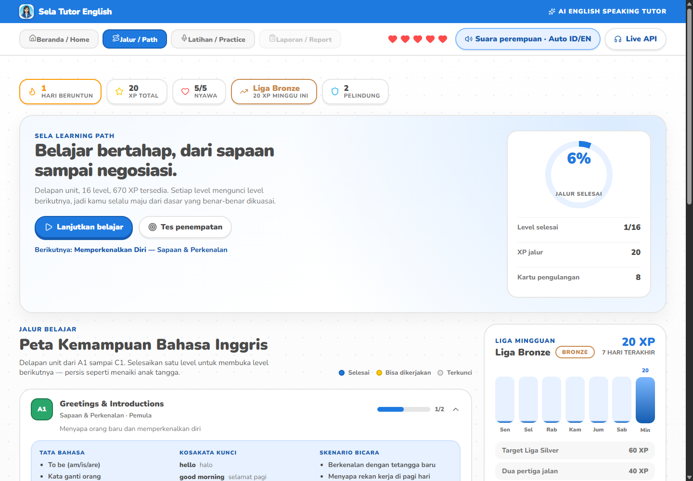
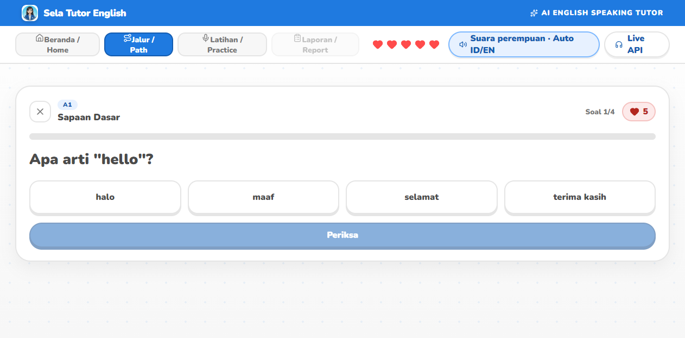
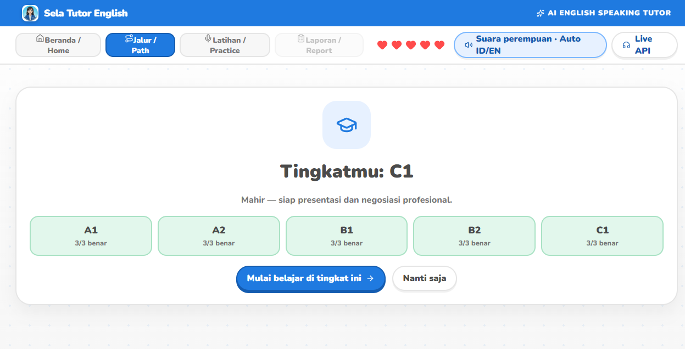

# User Guide

> **English** | [Bahasa Indonesia](#bahasa-indonesia)

---

## English

This guide walks through the whole learner journey, from the home screen to the
final evaluation report. Every screenshot below is a real capture of the running
app.

### 1. Home screen

The home screen introduces **Sela Tutor English** and shows your practice streak
and weekly activity. The primary action starts a new practice session. The top
navigation has four entries — **Home**, **Journey**, **Practice**, and **Report**
— each with an icon rather than an emoji, plus a hearts widget and Settings.

### 2. Learning path (Journey)

The **Journey** tab is your structured curriculum, ordered by CEFR level from A1
to C1. It is laid out like a path map: eight units, each holding two level nodes.

* A **green node with a badge** is finished and shows the score you earned.
* A **highlighted node** is open — this is your next step.
* A **greyed node with a padlock** is locked until you pass the level before it.

The top bar keeps your **streak**, **total XP**, **hearts**, and **league** in
sight at all times. The progress ring shows how much of the whole curriculum you
have completed.

To play a level, tap its node. You get the level's exercise set — four questions
drawn from five exercise types: arrange the sentence, match the pairs, fill the
blank, listen and type, or choose the translation.

**Passing:** you must answer every question correctly to pass a level. A wrong
answer costs one heart and the app never shows you the answer. If you run out of
hearts, the quiz is blocked until they recover (one heart every 30 minutes).

**Honest scoring:** XP is only awarded when you genuinely pass, and only once per
level — replaying a finished level never inflates your score.

Below the map you also get:

* **Weekly league board** — your XP for the last seven days and how far you are
  from promotion to the next league.
* **Review panel (SRS)** — flashcards for vocabulary from levels you have finished.
  Use **Load vocabulary** to add words, then review the cards that are due today;
  a correct answer pushes the card further into the future.

### 3. Placement test

Not sure where to start? Open the placement test from the Journey tab. It asks 15
questions spanning A1 to C1 and reports the level that fits you, with a per-level
breakdown. Your result seeds the review deck so you begin with vocabulary that
matches your level.

### 4. Choosing a scenario

Scenarios are real-world situations you might actually face:

| Scenario | Tasks |
| --- | --- |
| **Job Interview** | Internship Introduction · Strengths & Career Plan |
| **Business Meeting** | Share a Project Opinion |
| **Restaurant Ordering** | Order with Preferences |

Each card states the situation and the speaking skill you will train.

### 5. Picking a task

Inside a scenario you pick a specific task. Each task shows:

* its title,
* the **focus** (what the tutor will push you on),
* the **AI role** (interviewer, meeting chair, server),
* the opening question you will hear first.

### 6. Practice room

The practice room is the heart of the app. It contains:

* the **3D tutor avatar** (Sela) with real-time lip sync,
* a live status indicator (`idle`, `listening`, `thinking`, `asking`),
* the current round and the target goal,
* a **hint** panel in Indonesian to help you phrase your answer,
* a **voice engine chip** telling you which voice is actually speaking —
  `Supertonic F1 · Auto ID/EN` when the on-device voice is running, or
  `Suara browser (cadangan) · …` when the app has fallen back to the browser's
  built-in voice. Lip sync works either way,
* a microphone button to answer.

The avatar's mouth moves with the tutor's voice; when the tutor is silent, the
avatar breathes, blinks, and idles naturally.

### 7. Answering

Press the microphone button and speak in English. Your speech is transcribed
live. When you stop, the app:

1. sends your answer to the tutor,
2. shows the tutor "thinking",
3. plays the tutor's spoken reply (with lip sync),
4. adds both turns to the transcript.

If your browser has no microphone permission, the app still works — you can use
the text fallback.

**Choosing the language you speak.** Just above the answer bar there is a small
language picker — `Otomatis` / `Indonesia` / `Inggris`:

| Setting | What it does |
| --- | --- |
| `Otomatis` (default) | Starts in the language you used last, and switches automatically once it recognises that you changed language. |
| `Indonesia` | Locks recognition to Indonesian. |
| `Inggris` | Locks recognition to English. |

Changing this while the microphone is on restarts listening in the new language
**without** sending a half-finished answer. Your choice is remembered the next
time you open the app.

### 8. Transcript

The transcript lists every turn — **Sela** (tutor) and **You** (learner) — in
order, so you can re-read the whole conversation after the session.

### 9. Evaluation report

When the session ends, the app generates a structured report:

* **Score dimensions** — fluency, pronunciation, grammar, vocabulary, and task
  completion.
* **Sentence analysis** — a per-sentence breakdown with highlights.
* **Corrections** — a `diff`-style view of what you said versus a better version,
  with an arrow icon between the two.
* **Pronunciation tips** — concrete, targeted advice.
* **Evidence turns** — the specific exchanges the scores are based on.
* **Next practice** — what to work on next, linked to a follow-up task.

The report uses an **Answer → Action → Impact** structure so feedback is always
tied to a concrete improvement.

### 10. Settings — general

Open **Settings** to configure providers. You can pick a **preset** or configure
everything manually:

| Preset | LLM | TTS | ASR |
| --- | --- | --- | --- |
| **Sela Default** (recommended) | Groq | Supertonic | Browser native |
| Groq + ElevenLabs | Groq | ElevenLabs | Browser native |
| Global Mixed | OpenAI-compatible | Cartesia | AssemblyAI |
| China / Qwen | Qwen | Qwen TTS | Qwen ASR |
| Custom | any | any | any |

Settings are saved to `.sela-settings.json` on the server and take effect
immediately — no restart needed.

### 11. Settings — Supertonic TTS

The TTS section exposes everything Supertonic offers:

| Control | Options | Default |
| --- | --- | --- |
| **Voice** | `F1`–`F5` (female), `M1`–`M5` (male) | `F1` (female) |
| **Language mode** | `auto`, `id`, `en` | `auto` |
| **Speed** | 0.7 – 2.0 | 1.0 |
| **Quality steps** | 5 – 12 | 8 |
| **Service URL** | any | `http://127.0.0.1:7861` |

A green status dot shows whether the Supertonic sidecar is alive and ready.
Press **Pratinjau Suara** (Voice Preview) to hear your settings before saving.

With **auto** language mode, Sela speaks Indonesian in a female Indonesian voice
and switches to English automatically when the sentence is English — ideal for a
mixed tutor/learner conversation.

### 12. Tips for learners

* Speak in complete sentences — the tutor scores task completion.
* Use the Indonesian hint panel if you get stuck, then try again in English.
* Re-read the transcript before looking at the report; it helps the feedback land.
* Aim for the **Answer → Action → Impact** structure in every answer.
* Practise the same task twice and compare your scores.

### 13. Troubleshooting

| Problem | Solution |
| --- | --- |
| The tutor has no voice | Start the TTS sidecar (`npm run dev:tts`) or pick the browser voice |
| The avatar shows a photo instead of 3D | Your browser lacks WebGL; the app falls back automatically |
| The microphone does not work | Grant microphone permission; otherwise use the text fallback |
| Settings do not save | Make sure the backend is running on port 5174 |

---

## Bahasa Indonesia

Panduan ini menelusuri seluruh perjalanan pelajar, dari halaman beranda sampai
laporan evaluasi akhir. Setiap tangkapan layar di bawah adalah hasil nyata dari
aplikasi yang sedang berjalan.

### 1. Halaman beranda

Halaman beranda memperkenalkan **Sela Tutor English** dan menampilkan runtutan
latihan serta aktivitas mingguan Anda. Aksi utama memulai sesi latihan baru.
Navigasi atas punya empat entri — **Beranda**, **Jalur**, **Latihan**, dan
**Laporan** — masing-masing memakai ikon, bukan emoji, plus widget nyawa dan
Pengaturan.

### 2. Jalur belajar (Journey)

Tab **Jalur** adalah kurikulum terstruktur Anda, diurutkan berdasarkan tingkat
CEFR dari A1 sampai C1. Tampilannya seperti peta jalur: delapan unit, masing-masing
memuat dua simpul level.

* **Simpul hijau dengan lencana** berarti sudah selesai dan menunjukkan nilai Anda.
* **Simpul menyala** berarti terbuka — inilah langkah berikutnya.
* **Simpul kelabu dengan gembok** terkunci sampai Anda lulus level sebelumnya.

Bar atas selalu menampilkan **runtutan**, **total XP**, **nyawa**, dan **liga**
Anda. Cincin progres menunjukkan seberapa banyak kurikulum yang sudah Anda
selesaikan.

Untuk memainkan level, ketuk simpulnya. Anda akan mendapat satu set latihan — empat
soal dari lima tipe: susun kalimat, cocokkan pasangan, isi rumpang, dengar lalu
ketik, atau pilih terjemahan.

**Kelulusan:** Anda harus menjawab semua soal dengan benar agar level lulus.
Jawaban salah mengurangi satu nyawa dan aplikasi tidak pernah menunjukkan
jawabannya. Jika nyawa habis, kuis diblokir sampai nyawa pulih (satu nyawa setiap
30 menit).

**Penilaian jujur:** XP hanya diberikan saat Anda benar-benar lulus, dan hanya
sekali per level — memainkan ulang level yang sudah selesai tidak menambah nilai.

Di bawah peta Anda juga mendapat:

* **Papan liga mingguan** — XP Anda selama tujuh hari terakhir dan seberapa dekat
  Anda dengan promosi ke liga berikutnya.
* **Panel pengulangan (SRS)** — kartu flash untuk kosakata dari level yang sudah
  Anda selesaikan. Tekan **Muat kosakata** untuk menambah kata, lalu ulangi kartu
  yang jatuh tempo hari ini; jawaban benar mendorong kartu itu lebih jauh ke depan.

### 3. Tes penempatan

Bingung mulai dari mana? Buka tes penempatan dari tab Jalur. Tes ini menanyakan 15
soal dari A1 sampai C1 dan melaporkan level yang cocok untuk Anda, lengkap dengan
rincian per level. Hasilnya mengisi dek pengulangan agar Anda mulai dengan kosakata
yang sesuai level Anda.

### 4. Memilih skenario

Skenario adalah situasi dunia nyata yang mungkin benar-benar Anda hadapi:

| Skenario | Tugas |
| --- | --- |
| **Wawancara Kerja** | Perkenalan Diri Magang · Kelebihan & Rencana Karir |
| **Rapat Bisnis** | Menyampaikan Opini Proyek |
| **Pemesanan Restoran** | Pesan dengan Preferensi Khusus |

Setiap kartu menyatakan situasinya dan keterampilan berbicara yang akan dilatih.

### 5. Memilih tugas

Di dalam skenario Anda memilih tugas tertentu. Setiap tugas menampilkan:

* judulnya,
* **fokus** (apa yang akan dikejar tutor),
* **peran AI** (pewawancara, moderator rapat, pelayan),
* pertanyaan pembuka yang akan Anda dengar lebih dulu.

### 6. Ruang latihan

Ruang latihan adalah jantung aplikasi. Isinya:

* **avatar tutor 3D** (Sela) dengan lip sync real time,
* indikator status langsung (`idle`, `listening`, `thinking`, `asking`),
* ronde saat ini dan tujuan yang ditargetkan,
* panel **petunjuk** berbahasa Indonesia untuk membantu menyusun jawaban,
* **chip mesin suara** yang memberi tahu suara mana yang benar-benar dipakai —
  `Supertonic F1 · Auto ID/EN` bila suara on-device aktif, atau
  `Suara browser (cadangan) · …` bila aplikasi memakai suara bawaan browser.
  Lip sync tetap bekerja pada kedua kondisi,
* tombol mikrofon untuk menjawab.

Mulut avatar bergerak mengikuti suara tutor; saat tutor diam, avatar bernapas,
berkedip, dan diam secara alami.

### 7. Menjawab

Tekan tombol mikrofon lalu berbicara dalam Bahasa Inggris. Ucapan Anda
ditranskripsi langsung. Saat Anda berhenti, aplikasi:

1. mengirim jawaban Anda ke tutor,
2. menampilkan tutor sedang "berpikir",
3. memutar balasan bersuara tutor (dengan lip sync),
4. menambahkan kedua giliran ke transkrip.

Bila browser tidak punya izin mikrofon, aplikasi tetap jalan — Anda bisa memakai
cadangan teks.

**Memilih bahasa yang Anda ucapkan.** Tepat di atas bilah jawaban ada pemilih
bahasa kecil — `Otomatis` / `Indonesia` / `Inggris`:

| Pilihan | Fungsinya |
| --- | --- |
| `Otomatis` (default) | Mulai dengan bahasa terakhir yang Anda pakai, lalu berganti sendiri begitu terdeteksi Anda berpindah bahasa. |
| `Indonesia` | Mengunci pengenalan ke Bahasa Indonesia. |
| `Inggris` | Mengunci pengenalan ke Bahasa Inggris. |

Menggantinya saat mikrofon menyala akan memulai ulang pendengaran pada bahasa
baru **tanpa** mengirim jawaban yang belum selesai. Pilihan Anda diingat saat
aplikasi dibuka lagi.

### 8. Transkrip

Transkrip mencantumkan setiap giliran — **Sela** (tutor) dan **You** (pelajar) —
secara berurutan, sehingga Anda bisa membaca ulang seluruh percakapan setelah
sesi.

### 9. Laporan evaluasi

Saat sesi berakhir, aplikasi menghasilkan laporan terstruktur:

* **Dimensi skor** — kelancaran, pengucapan, tata bahasa, kosakata, dan
  penyelesaian tugas.
* **Analisis kalimat** — rincian per kalimat dengan sorotan.
* **Koreksi** — tampilan gaya `diff` antara ucapan Anda dan versi yang lebih
  baik, dengan ikon panah di antara keduanya.
* **Tips pengucapan** — saran konkret dan terarah.
* **Giliran bukti** — pertukaran spesifik yang mendasari skor.
* **Latihan berikutnya** — apa yang perlu dilatih, ditautkan ke tugas lanjutan.

Laporan memakai struktur **Answer → Action → Impact** sehingga umpan balik selalu
terikat pada perbaikan yang konkret.

### 10. Pengaturan — umum

Buka **Pengaturan** untuk mengonfigurasi provider. Anda bisa memilih **preset**
atau mengatur semuanya secara manual:

| Preset | LLM | TTS | ASR |
| --- | --- | --- | --- |
| **Sela Default** (disarankan) | Groq | Supertonic | Browser native |
| Groq + ElevenLabs | Groq | ElevenLabs | Browser native |
| Global Mixed | OpenAI-compatible | Cartesia | AssemblyAI |
| China / Qwen | Qwen | Qwen TTS | Qwen ASR |
| Custom | apa pun | apa pun | apa pun |

Pengaturan disimpan ke `.sela-settings.json` di server dan berlaku seketika —
tanpa perlu restart.

### 11. Pengaturan — Supertonic TTS

Bagian TTS menampilkan semua yang ditawarkan Supertonic:

| Kontrol | Opsi | Default |
| --- | --- | --- |
| **Suara** | `F1`–`F5` (perempuan), `M1`–`M5` (pria) | `F1` (perempuan) |
| **Mode bahasa** | `auto`, `id`, `en` | `auto` |
| **Kecepatan** | 0.7 – 2.0 | 1.0 |
| **Langkah kualitas** | 5 – 12 | 8 |
| **URL layanan** | apa pun | `http://127.0.0.1:7861` |

Titik status hijau menunjukkan apakah sidecar Supertonic hidup dan siap. Tekan
**Pratinjau Suara** untuk mendengar pengaturan Anda sebelum menyimpan.

Dengan mode bahasa **auto**, Sela berbicara Bahasa Indonesia dengan suara
perempuan Indonesia dan otomatis beralih ke Bahasa Inggris saat kalimatnya
berbahasa Inggris — ideal untuk percakapan campuran tutor/pelajar.

### 12. Tips untuk pelajar

* Bicaralah dengan kalimat lengkap — tutor menilai penyelesaian tugas.
* Gunakan panel petunjuk Bahasa Indonesia bila tersendat, lalu coba lagi dalam
  Bahasa Inggris.
* Baca ulang transkrip sebelum melihat laporan; itu membantu umpan balik lebih
  mudah dipahami.
* Usahakan struktur **Answer → Action → Impact** di setiap jawaban.
* Latih tugas yang sama dua kali lalu bandingkan skor Anda.

### 13. Pemecahan masalah

| Masalah | Solusi |
| --- | --- |
| Tutor tidak bersuara | Jalankan sidecar TTS (`npm run dev:tts`) atau pilih suara browser |
| Avatar menampilkan foto, bukan 3D | Browser Anda tidak punya WebGL; aplikasi otomatis beralih |
| Mikrofon tidak berfungsi | Berikan izin mikrofon; kalau tidak, pakai cadangan teks |
| Pengaturan tidak tersimpan | Pastikan backend berjalan di port 5174 |
